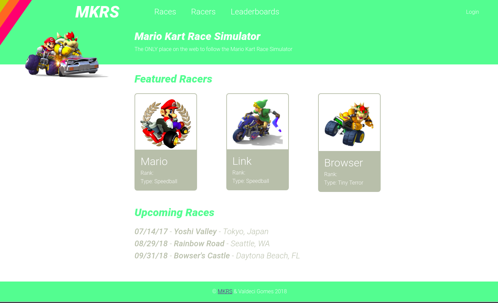

# nodejs-aws-mkrs

Mario Kart race simulator web app NodeJs and AWS based.

This repository project is based on the [hbfl](https://github.com/ryanmurakami/hbfl) project and 
contains a project ready to used on the 
[AWS Developer: Designing and Developing](http://www.pluralsight.com/courses/aws-developer-designing-developing) course 
on [Pluralsight.com](https://www.pluralsight.com/)

## Known Issues

- **Windows Users:** Create a directory called `.ssh` in your home directory (eg. `C:\Users\<your_name>`) before running scripts from Module 2

Found one? Please let me know by opening an [issue](https://github.com/ryanmurakami/hbfl/issues)!

## License

All Code under MIT license

